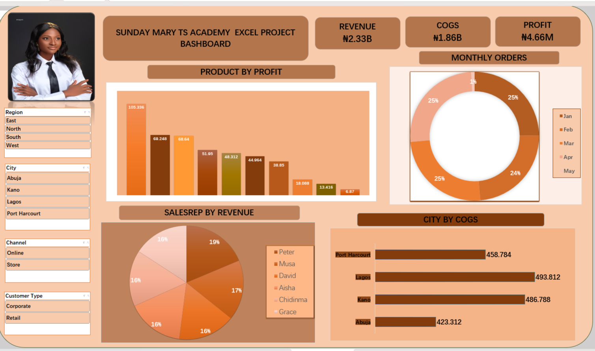

# Customer Sales Analysis Dashboard

## Project Overview

This project is an Excel-based customer sales analysis dashboard created to transform raw sales data into meaningful business insights.

The dashboard provides an interactive view of sales performance using charts, KPIs, and slicers.

## Dashboard Preview

## Tools Used

- Microsoft Excel
- Pivot Tables
- Pivot Charts
- Slicers
- Data Cleaning
- Data Analysis

## Dashboard Features

- Sales performance analysis
- Customer analysis
- Product/brand performance
- Revenue and profit analysis
- Interactive slicers
- Visual KPI summaries

## Key Skills Demonstrated

- Data cleaning and preparation
- Excel data analysis
- Data visualization
- Dashboard development
- Business insight generation

## Project Goal

The goal of this project was to practice using Excel to analyze customer sales data and present the results through an interactive and easy-to-understand dashboard.
